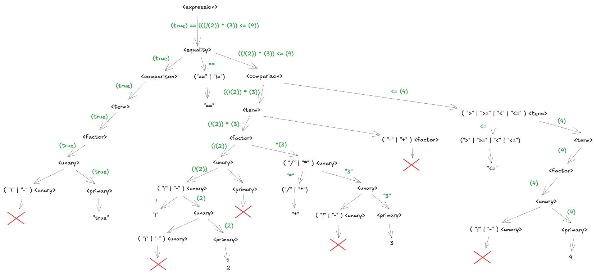

# Parser Package

A recursive descent parser generator for the Lox programming language. This parser automatically generates code from EBNF grammar specifications and handles operator precedence and associativity correctly.

## What This Does

This package provides a parser that converts a stream of tokens into an Abstract Syntax Tree (AST). The parser is generated from a grammar specification file, making it easy to modify the language syntax without manually rewriting parser code.

**Key Features:**
- Automatic parser generation from EBNF grammars
- Operator precedence handling (see diagram below)
- Parser combinator-based implementation
- Buffered token stream with backtracking support
- Type-safe AST node generation

## Operator Precedence and Associativity

The parser implements proper operator precedence as shown in this diagram:


From lowest to highest precedence:
1. Comma operator (`,`)
2. Equality operators (`==`, `!=`)
3. Comparison operators (`<`, `<=`, `>`, `>=`)
4. Term operators (`+`, `-`)
5. Factor operators (`*`, `/`)
6. Unary operators (`!`, `-`)
7. Primary expressions (literals, identifiers, grouping)

All binary operators are left-associative, meaning `a - b - c` is parsed as `(a - b) - c`.

## Grammar Specification

The parser uses the grammar defined in `lox.grammar`:

```ebnf
expression  ->   comma
comma       ->   equality ("," equality)*
equality    ->   comparison ( ( "!=" or "==" ) comparison )*
comparison  ->   term ( ( ">" or ">=" or "<" or "<=" ) term )*
term        ->   factor ( ( "-" or "+" ) factor )*
factor      ->   unary ( ( "/" or "*" ) unary )*
unary       ->   ( "!" or "-" ) unary or primary 
primary     ->   "IDENTIFIER" or "NUMBER" or "STRING" or "true" or "false" or "nil" or "(" expression ")"
```

This grammar is in EBNF (Extended Backus-Naur Form) format, which supports:
- `*` - Zero or more repetitions
- `+` - One or more repetitions  
- `( )` - Grouping
- `or` - Alternatives

## Architecture

### Parser Generation

The parser is generated in two parts:

1. **Grammar-Independent Code** - Core parsing infrastructure
   - `Node` interface for AST nodes
   - `ParseFunc` type for parser functions
   - Combinator helpers: `matchToken()`, `sequence()`, `choice()`
   - `Literal` struct for terminal nodes

2. **Grammar-Specific Code** - Generated from grammar file
   - AST node types for each non-terminal
   - Parser functions for each production rule
   - Entry point function matching the start symbol

### Parser Combinators

The parser uses combinator functions to build complex parsers from simple ones:

```go
// Match a specific token type
matchToken(dfa.NUMBER)

// Match a sequence of parsers in order
sequence(parseA, parseB, parseC)

// Try alternatives in order (first match wins)
choice(parseA, parseB, parseC)
```

### Buffered Lexer

The parser uses a `BufferedLexer` that provides:
- Token lookahead without consuming input
- Checkpoint/rollback for backtracking
- Efficient token buffering

This allows the parser to try different production rules without losing position in the token stream.

## Usage

### Generating a Parser

```go
package main

import (
    "bufio"
    "os"
    "github.com/VirajAgarwal1/lox/parser/grammar"
    "github.com/VirajAgarwal1/lox/lexer"
)

func main() {
    // Open grammar file
    grammarFile, _ := os.Open("lox.grammar")
    defer grammarFile.Close()
    
    // Parse the grammar
    scanner := &lexer.LexicalAnalyzer{}
    scanner.Initialize(bufio.NewReader(grammarFile))
    
    grammarRules, _ := grammar.ProcessGrammarDefinition(scanner)
    
    // Generate parser code
    outputFile, _ := os.Create("generated_parser.go")
    defer outputFile.Close()
    
    grammar.WriteParserForGrammar(grammarRules, outputFile, "expression")
}
```

### Using the Generated Parser

```go
package main

import (
    "bufio"
    "strings"
    "github.com/VirajAgarwal1/lox/parser"
    "github.com/VirajAgarwal1/lox/lexer"
)

func main() {
    // Create lexer
    source := "1 + 2 * 3"
    lex := &lexer.LexicalAnalyzer{}
    lex.Initialize(bufio.NewReader(strings.NewReader(source)))
    
    // Create buffered lexer for parser
    bufferedLex := &lexer.BufferedLexer{}
    bufferedLex.Initialize(lex)
    
    // Parse expression
    nodes, ok, err := parser.Parse_expression(bufferedLex)
    if err != nil {
        panic(err)
    }
    if !ok {
        panic("Failed to parse expression")
    }
    
    // Evaluate the parsed expression
    for _, node := range nodes {
        result := node.Evaluate()
        println(result.Inner)
    }
}
```

## AST Node Types

The generated parser creates typed AST nodes for each grammar rule:

```go
type Node interface {
    Evaluate() *Value
}

type Literal struct {
    Value *lexer.Token
}

// Generated for each non-terminal...
type Expression struct {
    Children []Node
}

type Factor struct {
    Left  Node
    Op    *Literal
    Right Node
}
```

Each node implements the `Evaluate()` method, which computes the value of the expression represented by that node.

## Value Types

The parser tracks Lox types:

```go
type Value struct {
    LoxType string  // "number", "string", "bool", "nil"
    Inner   any     // Actual Go value
}
```

## Error Handling

The parser provides detailed error information:
- Expected token type vs. actual token found
- Line and offset information for error location
- Backtracking to try alternative production rules

Errors are returned as standard Go errors with context preserved.

## Grammar File Format

Grammar files use a simple text format:

```
non_terminal_name -> definition
```

**Rules:**
- One production rule per line
- Use `->` to separate non-terminal from definition
- Terminals must be in quotes: `"if"`, `"+"`, `"IDENTIFIER"`
- Non-terminals are unquoted: `expression`, `statement`
- Use `or` for alternatives
- Use `*` for zero-or-more, `+` for one-or-more
- Use parentheses for grouping
- Comments start with `//`

## Design Decisions

**Why Recursive Descent?**
- Simple to understand and debug
- Natural mapping from grammar to code
- Easy to generate automatically
- Handles operator precedence elegantly

**Why Parser Combinators?**
- Composable and reusable
- Type-safe
- Easy to extend with new combinators
- Clean separation between grammar and parsing logic

**Why Code Generation?**
- Avoid manual parser maintenance
- Grammar changes automatically propagate
- Type-safe AST nodes for free

## Example Parsing

Here's how the parser handles `1 + 2 * 3`:

```
expression
  └─ comma
      └─ equality  
          └─ comparison
              └─ term
                  ├─ factor
                  │   └─ unary
                  │       └─ primary: 1
                  ├─ "+"
                  └─ factor
                      ├─ unary
                      │   └─ primary: 2
                      ├─ "*"
                      └─ unary
                          └─ primary: 3
```

The parser correctly recognizes that `*` has higher precedence than `+`, so it groups as `1 + (2 * 3)` rather than `(1 + 2) * 3`.



## Limitations

**Left Recursion**: The grammar cannot contain left-recursive rules (e.g., `expr -> expr "+" term`). The grammar must be written in a way that avoids left recursion, typically by using repetition operators like `*` and `+`.

**Error Recovery**: The parser currently has basic error handling but doesn't implement sophisticated error recovery strategies like panic mode or phrase-level recovery.

## Future Improvements

1. Better error messages with suggestions for fixes
2. Support for more EBNF features (optional `?`, ranges)
3. Automatic left-recursion elimination
4. Operator precedence declarations separate from grammar
5. Memoization for performance optimization

## See Also

- [Lexer Documentation](../lexer/README.md) - Token generation from source code
- [Streamable Parser](../streamable_parser/README.md) - Alternative LL(1) table-driven parser
- [Demo Programs](../demo/parser_demos/) - Example usage

---

The grammar-driven approach makes this parser easy to extend. Want to add new operators or language features? Just update the grammar file and regenerate!